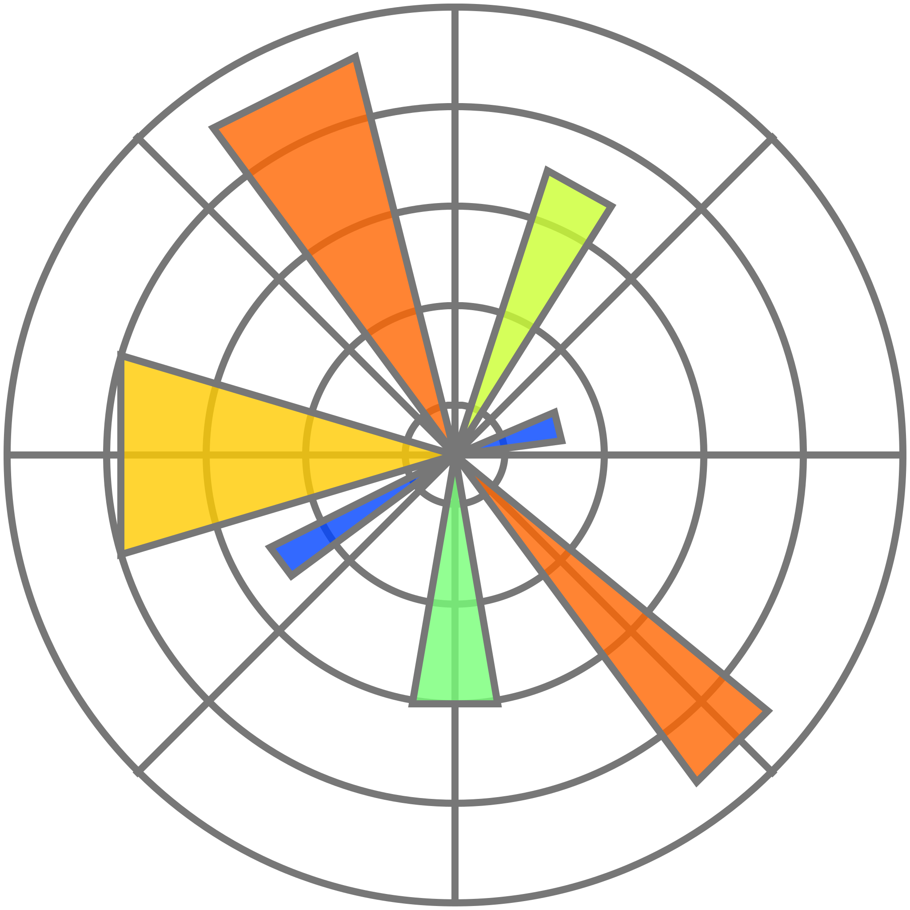

# Twitter Sentiment Algorithmic Trading Strategy

 

 

## Overview

- This repository is the result of following [this tutorial](https://www.youtube.com/watch?v=9Y3yaoi9rUQ) from Freecodecamp regarding how machine learning can be applied to algorithmic trading
- The purpose of following this tutorial was to expand my machine learning skills into an area of which I have nascent knowledge but an interest in, which is algorithmic trading
- The content of this repository consists of the developing of an algorithmic investment strategy based on an analysis of [Twitter](https://twitter.com/?lang=en) sentiment regarding the stocks of the [NASDAQ](https://www.nasdaq.com/)

## Algorithmic Trading Strategy Overview

- The initial step involves loading Twitter sentiment data relevant to stocks.
- Following this, the data is aggregated on a monthly basis, and the average sentiment for each month is calculated, providing a consolidated measure of market sentiment.
- Based on this sentiment analysis, the top 5 stocks are selected each month, utilizing cross-sectional ranking as a criterion.
- These selected stocks are then extracted to form portfolios at the beginning of each new month.
- To ensure accurate and up-to-date analysis, fresh stock prices are downloaded exclusively for the shortlisted stocks.
- With this updated pricing data, portfolio returns are calculated, and the portfolios are rebalanced on a monthly basis to adapt to changing market conditions.
- In addition to the analysis of our strategy, for comparative purposes, NASDAQ/QQQ prices are downloaded, and their returns are calculated to provide a comprehensive comparison between the performance of the strategy and the broader market represented by the NASDAQ/QQQ index.

View the actual.ipynb file to see the code implementation of the strategy
